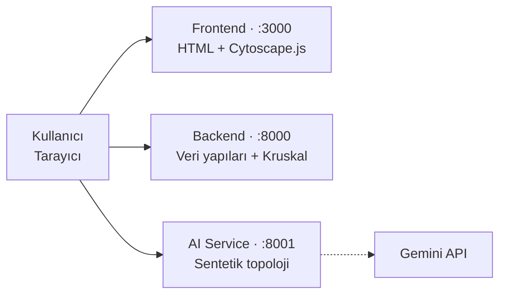

# PCB MST Optimizer

Karmaşık bir elektronik anakart (PCB) üzerindeki bileşenleri — dirençler, kapasitörler, entegreler, güç hatları — birbirine **en az toplam maliyetle, döngü oluşturmadan ve hiçbirini dışarıda bırakmadan** bağlayan en uygun ağı bulan web tabanlı bir simülasyon sistemi.

Bileşenler birer **düğüm**, aralarında çekilebilecek olası bağlantılar **ağırlıklı kenar** olarak modellenir. **Kruskal algoritması** bu kenarlar arasından tüm bileşenleri en ucuz şekilde birbirine bağlayan ağacı — **Minimum Spanning Tree (MST)** — seçer. Kullanıcı arayüzden yeni düğüm/kenar ekledikçe ağ anında yeniden hesaplanıp görselleştirilir.

> Veri Yapıları dersi grup projesi — Bahar 2026

---

##  Detaylı Proje Raporu

> ##  **[Tam Proje Raporu → `docs/PROJE_RAPORU.md`](docs/PROJE_RAPORU.md)**
>
> **UML diyagramları · Big-O (zaman/uzay) analizi · AI prompt dökümü · test sonuçları** 

---

## Ekip

| Üye | İsim | GitHub | Sorumluluk | Branch |
|---|---|---|---|---|
| 1 | Mehmet Kusgul | — | Backend / Veri Yapıları | `feature/uye1-backend-data-structures` |
| 2 | Sinasi Onuralp Akkurt | [@onuralpakkurt](https://github.com/onuralpakkurt) | Algoritma / API | `feature/uye2-algorithms-api` |
| 3 | Zafer Tuna | — | Frontend / AI Servisi | `feature/uye3-frontend-ai` |

---

## Hedef ve Senaryo

Bir PCB tasarımcısının çözmesi gereken problemi modelliyoruz: kart üzerindeki onlarca bileşeni birbirine bağlamak gerekir, ama her olası bağlantının bir maliyeti (bakır yol uzunluğu) vardır. Amaç; **tüm bileşenleri birbirine bağlayan**, **toplam maliyeti en düşük** ve **döngü içermeyen** ağı bulmaktır. Bu, klasik bir **Minimum Spanning Tree** problemidir.

Gerçek karttan modele geçiş:

| Gerçek PCB | Bu projede |
|---|---|
| Bileşenler (R, C, IC, U, Q, D, L, VCC, GND) | **Düğüm** (vertex) |
| İki bileşen arası çekilebilecek bakır yol | **Ağırlıklı kenar** (edge) |
| Yolun uzunluğu / maliyeti | **Kenar ağırlığı** |
| En ucuz, döngüsüz, eksiksiz bağlantı | **MST** (Kruskal) |
| Kartın bütün (bağlı) olup olmadığı | **Bağlılık testi** (BFS / DFS) |

---

## Mimari

Sistem, birbirinden bağımsız çalışan **üç mikroservisten** oluşur ve tek bir `docker compose up` komutuyla birlikte ayağa kalkar:



- **Frontend** (Vanilla HTML + JavaScript + Cytoscape.js) — Grafı tarayıcıda çizer; "MST hesapla" dendiğinde seçilen kenarlar **yeşil animasyonla** belirir. Düğüm/kenar eklenince ağ güncellenir ve MST yeniden hesaplanır.
- **Backend** (Python / FastAPI) — Projenin kalbi. Graf, Union-Find, Queue ve Stack **sıfırdan** yazılmıştır; Kruskal MST ile BFS/DFS bağlılık testleri burada koşar ve REST API üzerinden sunulur. AI'a bağımlı değildir.
- **AI Service** (Python / Google Gemini) — Test için sentetik PCB topolojileri üretir. Gemini anahtarı yoksa deterministik rastgele üretime (fallback) düşerek **her durumda** geçerli, bağlı bir graf döndürür. Optimizasyon kararı vermez.

---

## Özellikler

- AI ile veya hazır örnekle **sentetik PCB topolojisi** yükleme
- Grafı 2B düzlemde **Cytoscape.js** ile interaktif görselleştirme
- **Kruskal MST** hesaplama ve seçilen kenarları **yeşil animasyonla** vurgulama
- **Dinamik güncelleme:** düğüm/kenar ekle-sil → MST anında yeniden hesaplanır
- **BFS / DFS** ile bağlılık testi
- Canlı log paneli, servis sağlık rozetleri, sağ-tık ile silme
- 20–100 düğüm aralığında akıcı çalışma (100 düğüm → MST ~5 ms)

---

## Teknolojiler

- **Backend:** Python 3.11 · FastAPI · Uvicorn · Pydantic
- **Frontend:** HTML5 · Vanilla JavaScript (ES6+) · Cytoscape.js · nginx
- **AI:** Google Gemini (`gemini-2.5-flash`) + deterministik fallback
- **DevOps:** Docker · Docker Compose · Git (PR + branch koruması)

---

## Sıfırdan Yazılan Veri Yapıları

Şartname gereği hazır veri yapısı kütüphaneleri (`heapq`, `collections.deque`, `networkx` vb.) kullanılmadan, tümü `backend/app/data_structures/` altında elle yazıldı:

| Yapı | İç temsil | Amaç |
|---|---|---|
| **Graph** | Komşuluk listesi (dict-of-dict), yönsüz + ağırlıklı | Devre topolojisini modeller |
| **Union-Find** | `parent` + `rank`; path compression + union by rank | Kruskal'da döngüleri engeller |
| **Queue** | Tekli bağlı liste (head + tail işaretçili) | BFS için gerçek O(1) ekleme/çıkarma |
| **Stack** | LIFO | DFS dolaşımı |

---

## Algoritmalar ve Karmaşıklık

Tüm bileşenleri minimum maliyetle bağlayan ağ **Kruskal** ile bulunur; grafın bağlı olup olmadığı **BFS/DFS** ile doğrulanır.

| Algoritma / Yapı | Zaman | Kullanım |
|---|---|---|
| Kruskal (MST) | O(E log E) | MST hesaplama |
| Union-Find (PC + UbR) | ~O(1) amortize | Döngü kontrolü |
| BFS / DFS | O(V + E) | Bağlılık testi |

Ayrıntılı türetme ve gerçek ölçümler (100 düğüm / 250 kenar → ~5 ms) [proje raporunda](docs/PROJE_RAPORU.md).

---

## Proje Yapısı

```
pcb-mst-optimizer/
├── backend/                  # FastAPI — veri yapıları, Kruskal, REST API
│   └── app/
│       ├── data_structures/  # Graph, UnionFind, Queue, Stack (sıfırdan)
│       ├── algorithms/       # kruskal, bfs, dfs
│       ├── api/              # REST endpoint'leri
│       ├── services/         # graf state yönetimi (thread-safe)
│       └── models/           # Pydantic şemaları
├── ai-service/               # Gemini ile sentetik topoloji + fallback
├── frontend/                 # index.html + Cytoscape.js (nginx ile sunulur)
├── docs/
│   └── PROJE_RAPORU.md       # UML + Big-O + AI prompt dökümü (detaylı rapor)
└── docker-compose.yml        # 3 servisi tek komutta ayağa kaldırır
```

---

## Çalıştırma

### Docker (önerilen — tek komut)

```bash
# (opsiyonel) AI için Gemini anahtarı — verilmezse fallback çalışır
echo "GEMINI_API_KEY=..." > .env

docker compose up --build
```

- Arayüz → http://localhost:3000
- API (Swagger UI) → http://localhost:8000/docs

### Yerel (sadece backend)

```bash
cd backend
python -m venv venv
source venv/Scripts/activate        # Linux/Mac: source venv/bin/activate
pip install -r requirements.txt
uvicorn app.main:app --reload
```

Sistem; bilinen graflarda MST sonuçları elle doğrulanarak, sınır durumlar (kopuk graf, self-loop, boş graf) ve üç servisin Docker'la birlikte çalışması üzerinden uçtan uca test edilmiştir.

---

## API Özeti

| Method | Endpoint | Amaç |
|---|---|---|
| GET | `/health` | Servis sağlık kontrolü |
| POST | `/api/graph` | Yeni graf oluştur (sıfırla) |
| POST | `/api/graph/node` | Düğüm ekle |
| POST | `/api/graph/edge` | Ağırlıklı kenar ekle |
| GET | `/api/graph` | Mevcut grafı dön |
| GET | `/api/mst` | Kruskal ile MST hesapla |
| GET | `/api/graph/connected?algorithm=bfs\|dfs` | Graf bağlı mı? |

Backend ayaktayken etkileşimli dokümantasyon: `http://localhost:8000/docs`

---

## Sürüm Kontrolü

`main` korumalı daldır — doğrudan push yapılmaz. Geliştirme her üyenin kendi feature branch'inde yürütülür, kod incelemesinden sonra Pull Request ile `main`'e merge edilir.

---

## Lisans

MIT
