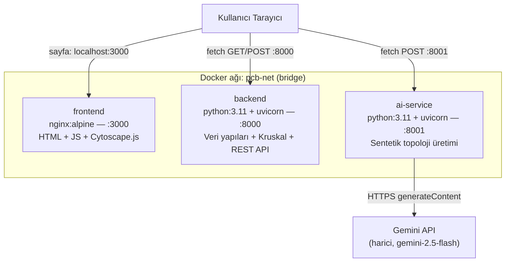
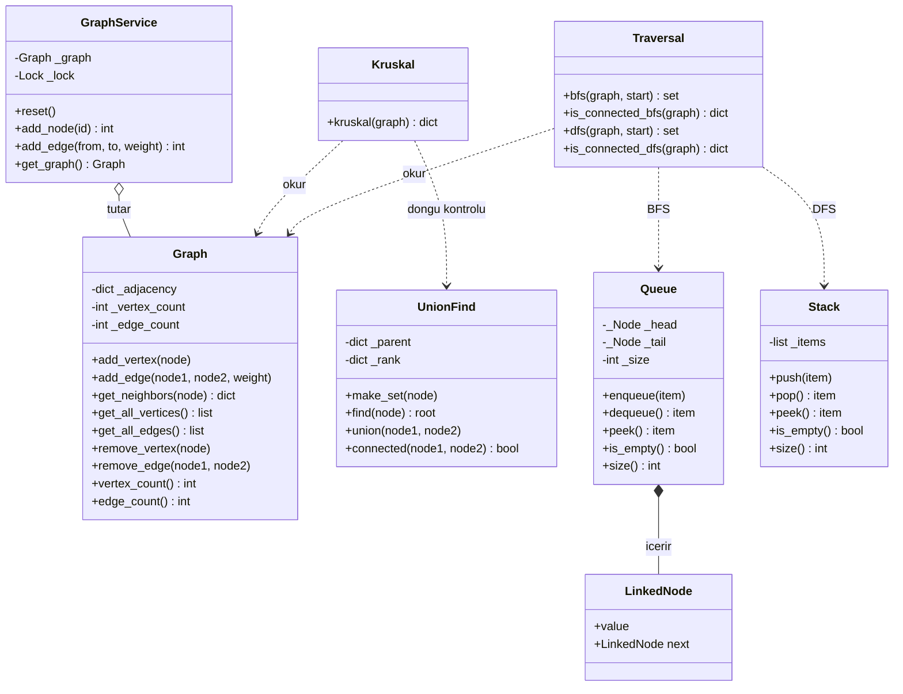
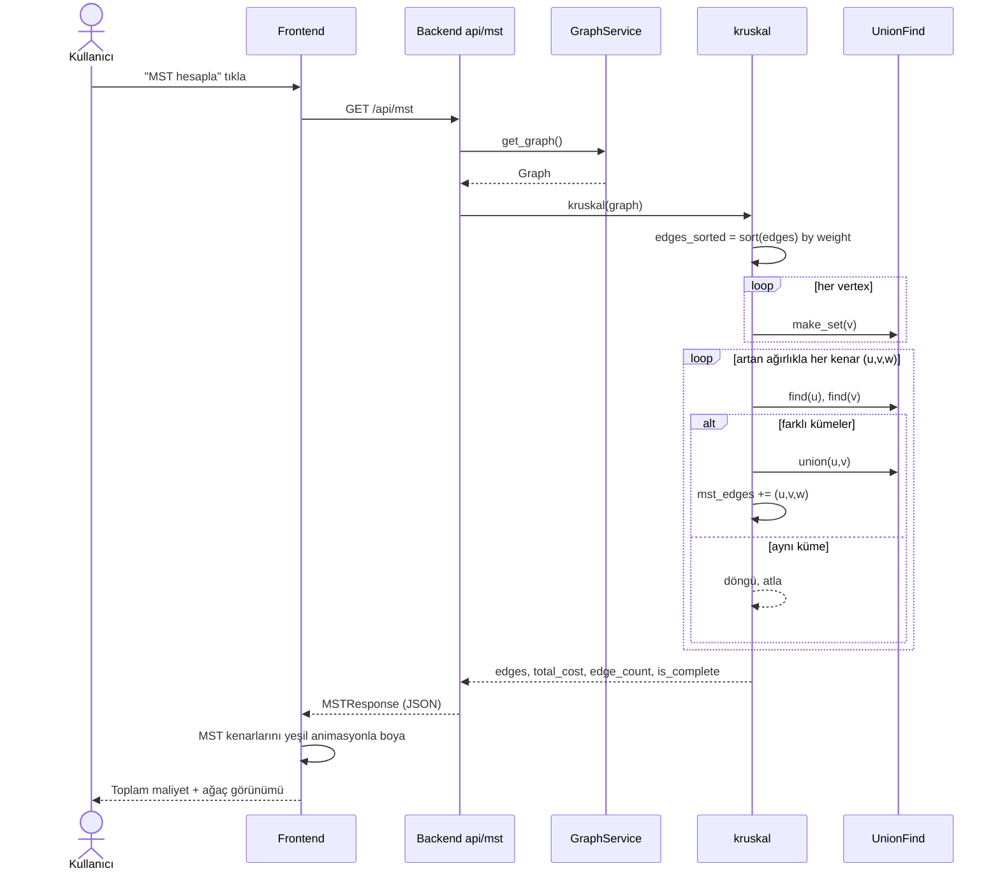
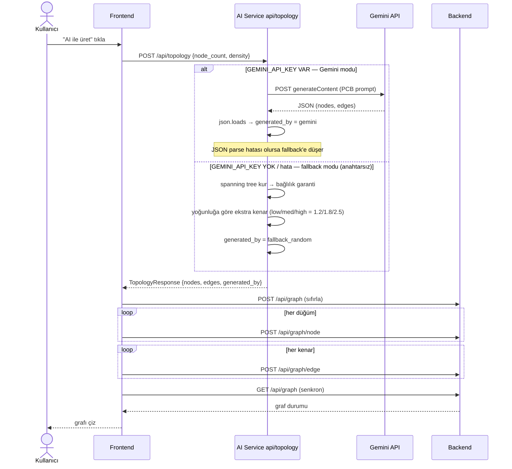

# PCB Bağlantı Ağı Optimizasyonu — Proje Raporu

**Ders:** Veri Yapıları — Grup Projesi (Bahar 2026)
**Proje:** PCB MST Optimizer
**Repo:** https://github.com/onuralpakkurt/-pcb-mst-optimizer

| Üye | İsim | Sorumluluk | Branch |
|---|---|---|---|
| 1 | Mehmet Kusgul | Backend / Veri Yapıları | `feature/uye1-backend-data-structures` |
| 2 | Sinasi Onuralp Akkurt | Algoritma / API | `feature/uye2-algorithms-api` |
| 3 | Zafer Tuna | Frontend / AI Servisi | `feature/uye3-frontend-ai` |

> Bu **tek dosyalık kapsamlı rapor**; sistem mimarisini, sıfırdan yazılan veri yapılarını, MST/dolaşım algoritmalarını, **UML diyagramlarını**, **zaman-uzay (Big-O) analizini** ve **AI prompt dökümünü** içerir. Tüm UML diyagramları Mermaid olarak gömülüdür ve GitHub'da otomatik render olur.

## İçindekiler
1. Problem Tanımı ve Soyutlama
2. Sistem Mimarisi 
3. Sıfırdan Yazılan Veri Yapıları 
4. Algoritmalar (+ MST Sıra UML)
5. Zaman ve Uzay Karmaşıklığı (Big-O) 
6. AI Servisi ve Prompt Dökümü 
7. REST API Referansı
8. Arayüz
9. Test ve Doğrulama Sonuçları
10. Kurulum ve Çalıştırma
11. Eşzamanlılık ve Mikroservis Yaklaşımı
12. Sürüm Kontrolü
13. Sonuç

---

## 1. Problem Tanımı ve Soyutlama

Karmaşık bir elektronik anakart (PCB) üzerindeki bileşenlerin (direnç, kapasitör, entegre, güç hatları vb.) en az toplam **bağlantı maliyetiyle**, **döngü içermeden** ve **tüm bileşenleri birbirine bağlayacak** şekilde bağlanması problemi modellenir. Bu, klasik **Minimum Spanning Tree (MST)** problemidir.

Gerçek PCB tasarımının sadeleştirilmiş soyutlaması:

| Gerçek PCB | Model karşılığı |
|---|---|
| Bileşenler (R, C, IC, U, Q, D, L, VCC, GND) | **Düğüm (vertex)** |
| İki bileşen arası çekilebilecek bakır yol (trace) | **Ağırlıklı kenar (edge)** |
| Yolun uzunluğu / maliyeti | **Kenar ağırlığı** |
| Tüm bileşenleri en az maliyetle, döngüsüz bağlamak | **MST (Kruskal)** |
| Kartın bütün (bağlı) olup olmadığı | **Bağlılık testi (BFS/DFS)** |

---

## 2. Sistem Mimarisi

Sistem, `docker-compose up` ile tek komutta ayağa kalkan **3 bağımsız mikroservisten** oluşur. Bu ayrım, ödev şartındaki *"AI simülasyon motorunun, veri yapılarının tutulduğu ana bellekten bağımsız/asenkron çalışması"* gereksinimini doğrudan karşılar: AI servisi ayrı bir process/container'dır ve backend'in graf belleğinden tamamen yalıtılmıştır.

### Deployment Diyagramı (UML)



**Akış sorumlulukları:**
- **Frontend** tarayıcıda çalışır; orkestrasyonu yapar: AI'dan topoloji ister → backend'e düğüm/kenar yükler → MST'yi backend'den çekip animasyonla çizer.
- **Backend** grafı bellekte (singleton `GraphService`) tutar; veri yapıları ve algoritmalar **burada, sıfırdan yazılmıştır**. AI'a bağımlı değildir.
- **AI Service** yalnızca **test verisi (sentetik topoloji)** üretir; MST/optimizasyon kararı **vermez**. Gemini yoksa deterministik random fallback'e düşer.

**Teknolojiler:** Python 3.11, FastAPI, Uvicorn, Pydantic · Vanilla JS + Cytoscape.js · Google Gemini API · Docker / Docker Compose.

---

## 3. Sıfırdan Yazılan Veri Yapıları (Faz 1)

Şartname gereği hazır veri yapısı kütüphaneleri (`heapq`, `collections.deque`, `networkx` vb.) **kullanılmadı**. Tüm yapılar `backend/app/data_structures/` altında sınıf bazlı yazıldı.

### 3.1 Sınıf Diyagramı (UML)



> Not: `LinkedNode`, kod içinde `Queue`'nun bağlı liste düğümü olan `_Node` sınıfıdır (diyagramda okunurluk için adlandırıldı).

### 3.2 Yapıların Açıklaması

| Yapı | İç temsil | Amaç |
|---|---|---|
| **`Graph`** | Komşuluk listesi (dict-of-dict), yönsüz, ağırlıklı | Devre topolojisi modeli |
| **`UnionFind`** | `_parent` + `_rank` sözlükleri; **path compression + union by rank** | Kruskal'da döngü tespiti |
| **`Queue`** | Tekli bağlı liste, `head` + `tail` işaretçisi | BFS dolaşımı (gerçek O(1) dequeue) |
| **`Stack`** | Python list (LIFO) | DFS dolaşımı |

- **Graph** kenar eklerken her iki yöne de yazar (`_adjacency[u][v] = _adjacency[v][u] = w`) ve `_edge_count`'u yalnızca yeni kenarda artırır; `remove_vertex` komşu kenarları da temizler.
- **UnionFind.find** özyinelemeli path compression uygular; **union** rank'e göre küçük ağacı büyüğe bağlar → ağaç yüksekliği düşük kalır, amortize **O(α(N)) ≈ O(1)**.
- **Queue** `tail` işaretçisi sayesinde `enqueue`/`dequeue` ikisi de **O(1)**; bağlı liste kullanıldığı için baştan silme array-kaydırma maliyeti taşımaz.

---

## 4. Algoritmalar (Faz 2)

### 4.1 Kruskal MST
```
1. Tüm kenarları ağırlığa göre artan sırada sırala.
2. Her düğüm için make_set (başta her düğüm kendi kümesinde).
3. Sıralı kenarları gez: kenarın iki ucu FARKLI kümelerdeyse
   (find(u) != find(v)) → kenarı MST'ye ekle, union(u, v).
   Aynı kümedeyse → döngü oluşur, atla.
4. (V-1) kenara ulaşınca dur.
```
- Bağlı olmayan grafta MST yerine **spanning forest** döner ve `is_complete=False` bilgisini verir (`message: "Graph is disconnected; partial spanning forest returned"`).

### 4.2 BFS / DFS — Bağlılık Testi
- **BFS** kendi `Queue` yapısını, **DFS** kendi `Stack` yapısını kullanır.
- Bir başlangıç düğümünden erişilen düğüm sayısı toplam düğüm sayısına eşitse graf **bağlıdır**.
- Kullanım: (1) MST öncesi bağlılık kontrolü, (2) MST sonrası tüm düğümlerin erişilebilirliği, (3) kullanıcı düğüm/kenar ekledikten sonra yeniden analiz.

### 4.3 MST Hesaplama Sıra Diyagramı (UML)



---

## 5. Zaman ve Uzay Karmaşıklığı (Big-O) — Detaylı

Notasyon: **V** = düğüm sayısı, **E** = kenar sayısı, **N** = Union-Find eleman sayısı, **α** = ters Ackermann fonksiyonu (pratikte ≤ 4, ~sabit).

### 5.1 Veri Yapıları

**Graph (komşuluk listesi, dict-of-dict)** — sözlük erişimi ortalama O(1):

| Operasyon | Zaman | Uzay |
|---|---|---|
| `add_vertex(v)` | O(1) | O(V) toplam |
| `add_edge(u,v,w)` | O(1) | O(E) toplam |
| `get_neighbors(v)` | O(deg(v)) | O(deg(v)) |
| `get_all_vertices()` | O(V) | O(V) |
| `get_all_edges()` | O(V + E) | O(E) |
| `remove_vertex(v)` | O(deg(v)) | — |
| `remove_edge(u,v)` | O(1) | — |

**UnionFind (path compression + union by rank):**

| Operasyon | Zaman (amortize) |
|---|---|
| `make_set` | O(1) |
| `find` | O(α(N)) ≈ O(1) |
| `union` | O(α(N)) ≈ O(1) |
| `connected` | O(α(N)) |

m işlem için toplam **O(m·α(N))**; α(N) tüm pratik N için ≤ 4 → etkin sabit. Uzay O(N).

**Queue (bağlı liste, head+tail)** ve **Stack (list):** tüm temel işlemler `enqueue/dequeue/push/pop/peek/is_empty/size` → **O(1)**, uzay O(N). (Python list ile baştan silme O(N) olurdu; bağlı liste bunu O(1) yapar — BFS için kritik.)

### 5.2 Algoritmalar

**Kruskal (MST):**

| Adım | Maliyet |
|---|---|
| Kenarları topla (`get_all_edges`) | O(V + E) |
| Kenarları sırala | **O(E log E)** ← baskın |
| V kez `make_set` | O(V) |
| E kenar için `find`/`union` | O(E·α) ≈ O(E) |

**Toplam zaman: O(E log E) = O(E log V)** (çünkü E ≤ V² → log E ≤ 2 log V). Baskın terim sıralamadır. **Uzay: O(V + E).** Tam graf (E ≈ V²) için pratik O(V² log V).

**BFS / DFS:** her düğüm bir kez işlenir, her kenar sabit kez taranır → **Zaman O(V + E), Uzay O(V)** (visited + kuyruk/yığın).

### 5.3 Pratik Ölçüm (doğrulama)

| Graf | MST gecikmesi | BFS gecikmesi |
|---|---|---|
| 8 düğüm / 12 kenar | < 2 ms | < 1 ms |
| 100 düğüm / 250 kenar | **~5 ms** | **~2 ms** |

Ölçümler teorik O(E log E) / O(V + E) sınırlarıyla tutarlıdır; bu boyutlarda darboğaz algoritma değil HTTP katmanıdır.

*Kaynak: CLRS, Introduction to Algorithms 3rd Ed. — Böl. 21 (Disjoint Sets), Böl. 23 (MST).*

---

## 6. AI Servisi ve Prompt Dökümü

- **Rol:** Yalnızca **sentetik test topolojisi** üretmek. MST/analiz kararı vermez (ödevde GenAI **opsiyonel yardımcı araç**). Anahtar yoksa servis fallback ile çalışmaya devam eder.
- **Model:** `gemini-2.5-flash` (v1beta `generateContent`). Anahtar `.env` üzerinden (`GEMINI_API_KEY`); repoya commit edilmez (`.gitignore`).
- **Fallback:** `generate_fallback_topology` — önce bir spanning tree kurup **bağlılığı garantiler**, sonra yoğunluğa göre (low/medium/high → 1.2/1.8/2.5 çarpanı) kenar ekler.
- **Sağlamlık ayarı:** `gemini-2.5-flash` bir "thinking" modeldir; düşünme token'ları çıktıyı kesebilir. Bu yüzden `generationConfig` içinde `thinkingBudget: 0`, `maxOutputTokens: 8192`, `responseMimeType: application/json` ayarlandı.

### 6.1 AI Topoloji Üretim Sıra Diyagramı (UML)



### 6.2 Prompt Dökümü (gerçek çağrı)

**2026-06-03 — Sentetik PCB topoloji üretimi**
**Amaç:** Backend MST/bağlılık algoritmalarını test etmek için 8 bileşenli, bağlı, orta yoğunluklu sentetik PCB grafı üretmek.
**Model:** gemini-2.5-flash · **Parametreler:** `node_count=8, max_weight=100, density=medium`

**Gönderilen prompt:**
```
Sen bir PCB (Printed Circuit Board) tasarım asistanısın.
8 adet PCB bileşeni ve aralarındaki ağırlıklı bağlantıları içeren
sentetik bir PCB topolojisi üret.

Kurallar:
- Bileşen isimleri gerçekçi PCB component adları olsun (R1, C2, IC1, U1, VCC, GND vb.)
- Kenar ağırlıkları 1-100 arasında olsun (kısa=düşük, uzun=yüksek maliyet)
- Yoğunluk: medium (low=az kenar, medium=orta, high=çok kenar)
- Graf bağlı (connected) olmalı
- Döngüler içerebilir (MST algoritması bunları kaldıracak)

SADECE aşağıdaki JSON formatında yanıt ver, başka hiçbir şey yazma:
{ "nodes": [...], "edges": [{"source","target","weight"}], "description": "..." }
```

**Gemini'nin gerçek cevabı (JSON):**
```json
{
  "nodes": ["R1", "C1", "IC1", "U2", "VCC", "GND", "D1", "L1"],
  "edges": [
    {"source": "R1",  "target": "C1",  "weight": 25},
    {"source": "R1",  "target": "IC1", "weight": 40},
    {"source": "C1",  "target": "VCC", "weight": 10},
    {"source": "IC1", "target": "U2",  "weight": 30},
    {"source": "IC1", "target": "GND", "weight": 15},
    {"source": "U2",  "target": "D1",  "weight": 50},
    {"source": "U2",  "target": "L1",  "weight": 65},
    {"source": "VCC", "target": "IC1", "weight": 20},
    {"source": "GND", "target": "C1",  "weight": 5},
    {"source": "D1",  "target": "GND", "weight": 35},
    {"source": "L1",  "target": "VCC", "weight": 45},
    {"source": "R1",  "target": "VCC", "weight": 55}
  ],
  "description": "8 bileşenli, orta yoğunluklu ve bağlı bir PCB topolojisi."
}
```

**Sonuç:** 8 düğüm, 12 kenar; graf bağlı (BFS 8/8). Backend'de MST hesaplandığında **toplam maliyet = 165**, 7 kenar (V−1), `is_complete=True`, `generated_by="gemini"`. MST kenarları: C1–GND(5), C1–VCC(10), IC1–GND(15), R1–C1(25), IC1–U2(30), GND–D1(35), VCC–L1(45).

---

## 7. REST API Referansı

**Backend (:8000)**

| Method | Endpoint | Amaç |
|---|---|---|
| GET | `/health` | Sağlık kontrolü |
| POST | `/api/graph` | Yeni graf (sıfırla) |
| POST | `/api/graph/node` | Düğüm ekle |
| POST | `/api/graph/edge` | Ağırlıklı kenar ekle (self-loop 400, weight≤0 422) |
| GET | `/api/graph` | Mevcut grafı dön |
| GET | `/api/mst` | Kruskal ile MST hesapla |
| GET | `/api/graph/connected?algorithm=bfs\|dfs` | Bağlılık testi |

**AI Service (:8001):** `GET /health`, `POST /api/topology`, `GET /api/topology/sample`. Swagger UI: `http://localhost:8000/docs`.

---

## 8. Arayüz (Faz 3)

- **Görselleştirme:** Cytoscape.js; düğümler 2B düzlemde noktalar, kenarlar ağırlık etiketli çizgiler.
- **Algoritma görselleştirme:** "MST hesapla" → seçilen MST kenarları **yeşil renkle animasyonlu** belirir, MST dışı kenarlar soluk gri.
- **Dinamik güncelleme:** Kullanıcı düğüm/kenar ekler → graf güncellenir → MST yeniden hesaplanır → sonuç anında gösterilir.
- **Ek özellikler:** BFS/DFS bağlılık testi, sağ-tık ile silme, canlı log paneli, servis sağlık rozetleri, AI ile/örnek topoloji yükleme.
- **Performans notu:** 20–100 düğüm aralığında akıcı; yoğun graflarda MST dışı kenarlar soluklaştırılarak görsel karmaşıklık azaltılır.

---

## 9. Test ve Doğrulama Sonuçları

Sistem hem yerel (venv) hem Docker (`docker compose up --build`) ile ayağa kaldırılıp uçtan uca test edildi.

| Test | Beklenen | Sonuç |
|---|---|---|
| Gemini üretimi 8 düğümlü graf → MST | doğru MST | ✅ maliyet 165 / 7 kenar |
| Bilinen örnek graf MST | 36 / 7 kenar | ✅ 36.0 / 7 |
| BFS & DFS bağlılık (bağlı graf) | 8/8 bağlı | ✅ |
| Kopuk graf MST | forest, is_complete=False | ✅ |
| Self-loop kenar | HTTP 400 | ✅ |
| Ağırlık = 0 | HTTP 422 | ✅ |
| Boş graf MST | HTTP 400 | ✅ |
| Dinamik düğüm ekleme + yeniden MST | maliyet güncellenir | ✅ |
| **Performans** | 20–100 düğüm makul süre | ✅ **100V/250E → MST 5 ms, BFS 2 ms** |

---

## 10. Kurulum ve Çalıştırma

### Docker (önerilen — tek komut)
```bash
# (opsiyonel) AI için anahtar:
echo "GEMINI_API_KEY=AIza..." > .env     # repoya gitmez (.gitignore)
docker compose up --build
# Arayüz: http://localhost:3000  |  API: http://localhost:8000/docs
```
Anahtar verilmezse AI servisi otomatik **fallback random** moduyla çalışır.

### Yerel Geliştirme (venv)
```bash
cd backend
python -m venv venv && source venv/Scripts/activate   # Win: venv\Scripts\activate
pip install -r requirements.txt
uvicorn app.main:app --reload                          # :8000
# AI servisi: cd ../ai-service && uvicorn main:app --port 8001
```

---

## 11. Eşzamanlılık ve Mikroservis Yaklaşımı

- **Servis yalıtımı:** AI motoru (`ai-service`) backend graf belleğinden ayrı bir container/process'tir; bağımsız ölçeklenir, çöker/yavaşlarsa backend etkilenmez (fallback devreye girer).
- **Thread-safety:** Backend graf durumu tekil `GraphService` içinde tutulur; tüm mutasyonlar (`reset`, `add_node`, `add_edge`) `asyncio.Lock` ile korunur.
- **Asenkron I/O:** FastAPI + Uvicorn (ASGI); AI servisi Gemini çağrılarını `httpx.AsyncClient` ile non-blocking yapar.

---

## 12. Sürüm Kontrolü (Git)

- `main` korumalı dal; doğrudan push yok, yalnızca **PR ile merge**.
- Üye başına ayrı feature branch; her özellik code review (≥1 onay) sonrası merge edildi.
- Üç üyenin de commit geçmişi mevcuttur (PR tabanlı iş akışı).

---

## 13. Sonuç

Proje; sıfırdan yazılan veri yapıları (Graph, Union-Find, Queue, Stack) üzerine kurulu **Kruskal MST** algoritmasını, BFS/DFS bağlılık analizini, dinamik düğüm ekleme destekli görsel bir arayüzü ve sentetik veri üreten ayrık bir AI servisini tek `docker-compose` altında bütünleştirir. MST sonuçları elle doğrulandı; sistem 20–100 düğüm aralığında milisaniyeler mertebesinde çalışır.
