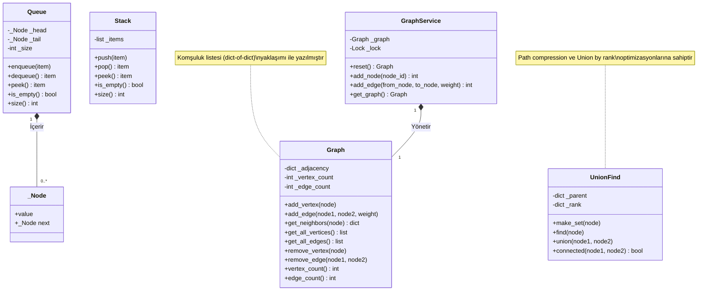
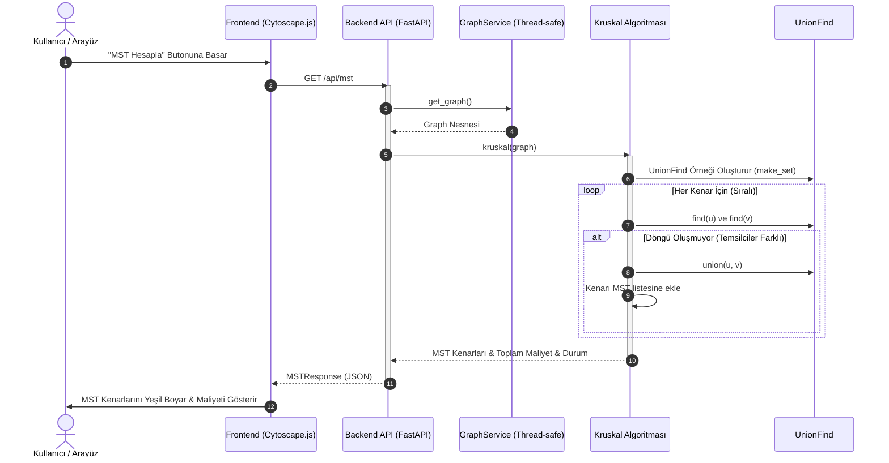

# UML Diyagramları (Mermaid)

Bu sayfada projenin sınıf yapısı (Class Diagram), MST hesaplama iş akışı (Sequence Diagram) ve sistem mimarisi (Deployment Diagram) yer almaktadır. Markdown okuyucunuz veya GitHub Mermaid desteği sayesinde bu diyagramları doğrudan görüntüleyebilirsiniz.

---

## 1. Sınıf Diyagramı (Class Diagram)

Aşağıdaki diyagram sıfırdan yazılan veri yapılarını, API servis katmanını ve aralarındaki ilişkileri göstermektedir:



---

## 2. MST Hesaplama Akışı (Sequence Diagram)

Kullanıcı arayüzden MST hesaplamasını tetiklediğinde gerçekleşen akış:



---

## 3. Dağıtım / Konteyner Mimarisi (Deployment Diagram)

`docker-compose` ile ayağa kalkan mikroservis mimarisi:

```mermaid
graph TD
    subgraph Docker Compose Ağı (Default Bridge)
        FE[Frontend Container<br/>Port 80/8080] <-->|HTTP API İstekleri| BE[Backend Container<br/>FastAPI / Port 8000]
        BE <-->|HTTP/REST| AI[AI Service Container<br/>Python + Gemini API / Port 8001]
    end
    
    Kullanıcı -->|Tarayıcı ile Erişim| FE
```
